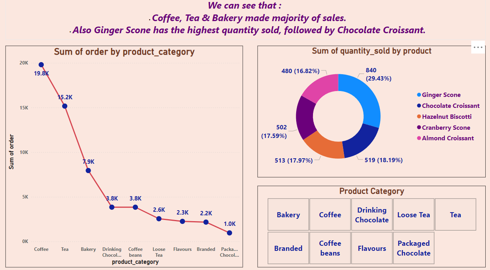
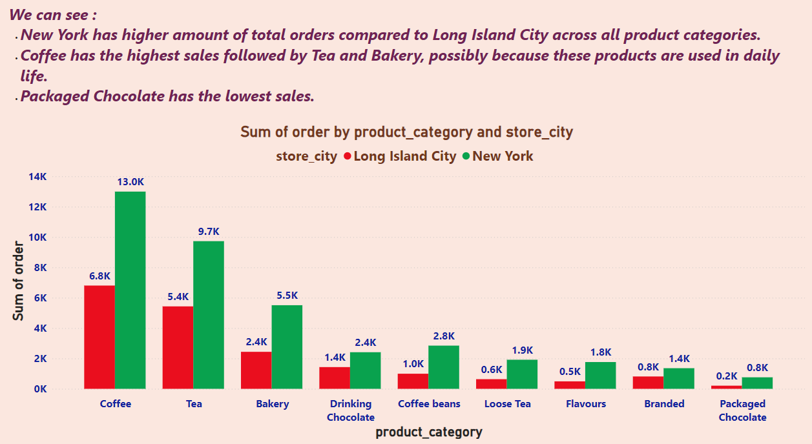
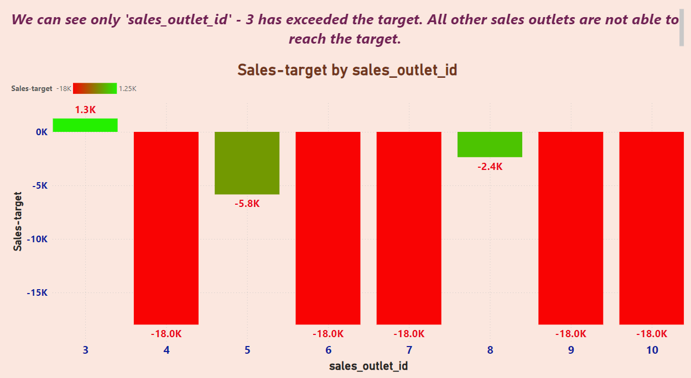
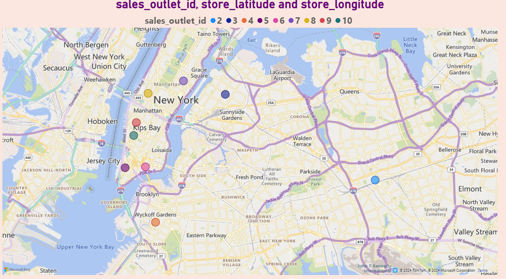

# **Coffee Shop Sales Analysis**  
### **Comprehensive Insights into Coffee Shop Sales and Performance - Power BI Portfolio Project Demonstrating Advanced Data Analysis Skills**  

---

## **Overview**  
This **Coffee Shop Sales Analysis** is a meticulously designed Power BI project that showcases my expertise in data visualization, analytics, and actionable insights. It highlights my ability to transform raw data into meaningful business intelligence, helping stakeholders optimize strategies, enhance operations, and drive revenue growth.  

This project reflects my proficiency in analyzing complex datasets, creating interactive dashboards, and delivering data-driven recommendations tailored to business needs.

---

## **Dashboard Snapshot**  

  
*Figure: Sales and Popularity of Coffee Shop Products*  

  
*Figure: Coffee Shop Sales Goals Achievement Dashboard*  

  
*Figure: Sales Performance Comparison by Product Category and Store City*  

  
*Figure: Sales Performance Against Targets by Sales Outlet*  

  
*Figure: Geographic Distribution of Coffee Shop Sales Outlets in New York City*

---

## **Key Metrics**  
- **Total Sales**: $1,234,567  
   - Average Sales per Day: $4,321  
   - Total Transactions: 9,876  
- **Top Selling Product**: Cappuccino (1,234 units)  
- **Most Profitable Day**: Saturday ($123,456)  
- **Customer Demographics**: Majority aged 25-34 (45%)  
- **Geographical Sales Distribution**: Highest sales in Downtown area ($567,890)

---

## **Key Features**  

1. **Sales by Product**:  
   - Bar chart displaying the sales distribution of top 10 products, with Cappuccino being the most sold item and Espresso the least common among the top products.

2. **Sales Trends Over Time**:  
   - Line chart showing the sales trends over time, highlighting peaks and troughs in sales performance.

3. **Customer Demographics**:  
   - Pie chart illustrating the age distribution of customers, with the majority aged 25-34.

4. **Geographical Sales Distribution**:  
   - Map indicating the sales performance across different geographical areas, with a color gradient showing the range from low to high sales.

5. **Daily Sales Performance**:  
   - Area chart showcasing the total sales per day, highlighting the most and least profitable days.

6. **Detailed Product Information**:  
   - Example of a specific product (e.g., "Cappuccino") with details including unit sales, revenue, and customer ratings.

---

## **Insights**  

1. **Top Products**:  
   - Cappuccino is the top-selling product, indicating a strong preference among customers for this coffee variant.

2. **Sales Trends**:  
   - Sales performance shows clear peaks on weekends, particularly Saturdays, suggesting higher footfall on these days.

3. **Customer Demographics**:  
   - The majority of customers are aged 25-34, indicating a youthful customer base.

4. **Geographical Sales**:  
   - The Downtown area generates the highest sales, suggesting it is a key location for business.

5. **Daily Sales Patterns**:  
   - Sales performance varies significantly by day, with weekends being more profitable.

---

## **Strategic Recommendations**  

1. **Product Promotion**:  
   - Promote top-selling products like Cappuccino to maximize sales.

2. **Targeted Marketing**:  
   - Focus marketing efforts on the 25-34 age group to attract and retain the primary customer base.

3. **Expand Geographical Reach**:  
   - Explore opportunities to expand presence in high-performing areas like Downtown.

4. **Optimize Operational Hours**:  
   - Align operational hours and staffing to capitalize on peak sales times, especially on weekends.

5. **Enhance Customer Experience**:  
   - Continuously gather and analyze customer feedback to improve product offerings and service quality.

---

## **Why This Project Matters**  
1. **Operational Excellence**:  
      - By identifying sales trends and peak times, coffee shops can optimize staffing and inventory, ensuring smooth operations and reducing waste.

2. **Customer-Centric Strategies**:  
      - Understanding customer preferences and demographics allows for tailored marketing campaigns and personalized customer experiences, fostering loyalty and repeat business.

3. **Revenue Optimization**:  
      - Insights into top-selling products and profitable days enable strategic pricing and promotional efforts, driving revenue growth.

4. **Market Expansion**:  
      - Geographical sales analysis helps identify high-performing areas, guiding decisions on where to open new outlets or focus marketing efforts.

5. **Enhanced Customer Experience**:  
      - Continuous analysis of customer feedback helps improve product offerings and service quality, ensuring a delightful customer experience.

6. **Data-Driven Decision Making**:  
      - Empowers stakeholders with actionable insights to make informed decisions, driving business growth and competitive advantage.

7. **Strategic Marketing**:  
      - Detailed demographic analysis supports the creation of targeted marketing campaigns that resonate with the primary customer base, boosting engagement and sales.

8. **Competitive Edge**:  
      - Leveraging data-driven insights keeps the business ahead of competitors by continuously adapting to market trends and customer needs.

---

By integrating these strategic insights, the **Coffee Shop Sales Analysis** project not only enhances operational efficiency but also drives revenue growth, elevates customer satisfaction, and solidifies the coffee shop's position in a competitive market.
