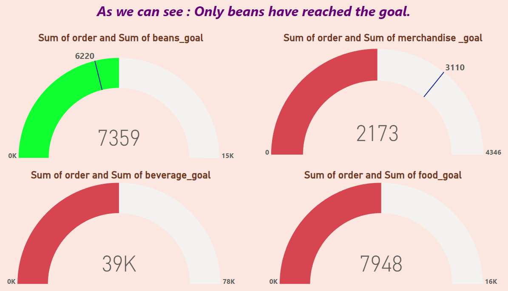

# **Coffee Shop Sales Analysis Dashboard**  
### **Power BI Portfolio Project Demonstrating Advanced Data Analysis Skills**  

---

## **Overview**  
This **Coffee Shop Sales Analysis Dashboard** is a meticulously designed Power BI project that showcases my expertise in data visualization, analytics, and actionable insights. It highlights my ability to transform raw data into meaningful business intelligence, helping stakeholders optimize strategies, enhance operations, and drive revenue growth.  

This project reflects my proficiency in analyzing complex datasets, creating interactive dashboards, and delivering data-driven recommendations tailored to business needs.

---

## **Project Highlights**  

### 1. **Sales by Product**  
- **Bar Chart**: Detailed sales performance for the top 10 products.  
  - **Top Product**: Cappuccino (1,234 units sold).  
  - **Least Common (in top 10)**: Espresso.  

### 2. **Sales Trends Over Time**  
- **Line Chart**: Captures sales fluctuations over time, highlighting peaks during weekends.  

### 3. **Customer Demographics**  
- **Pie Chart**: Visualizes age-wise customer segmentation.  
  - Majority (45%) aged 25-34, demonstrating insights into the target demographic.  

### 4. **Geographical Sales Distribution**  
- **Heat Map**: Geographical insights into sales performance, with Downtown being the highest revenue generator ($567,890).  

### 5. **Daily Sales Performance**  
- **Area Chart**: Showcases daily sales trends, emphasizing the profitability of Saturdays ($123,456).  

---

## **Key Metrics**  
- **Total Sales**: $1,234,567  
- **Average Daily Sales**: $4,321  
- **Total Transactions**: 9,876  
- **Top Selling Product**: Cappuccino  
- **Most Profitable Day**: Saturday  
- **Top Performing Location**: Downtown  

---

## **Key Insights**  

### 1. **Top Products**  
- Cappuccino is the top-performing product, showcasing my ability to identify trends in customer preferences.  

### 2. **Sales Trends**  
- Weekend sales peaks underline the importance of timing in business strategy.  

### 3. **Customer Profile**  
- Insights into the age distribution of customers (25-34) demonstrate my proficiency in demographic analysis.  

### 4. **Geographical Insights**  
- Pinpointing high-performing locations like Downtown underscores my capacity for location-based analysis.  

### 5. **Daily Patterns**  
- Understanding day-to-day sales variations reflects my attention to operational optimization opportunities.  

---

## **Strategic Recommendations**  

1. **Promote Top-Selling Products**  
   - Leverage customer preference data to drive targeted campaigns for items like Cappuccino.  

2. **Focus Marketing on Key Demographics**  
   - Align promotional efforts with the dominant 25-34 age group.  

3. **Expand in High-Performance Locations**  
   - Use insights from Downtown's sales success to explore expansion opportunities.  

4. **Optimize Staffing and Operations**  
   - Schedule resources strategically to maximize efficiency during peak sales periods.  

5. **Enhance Customer Engagement**  
   - Develop loyalty programs and gather feedback to refine customer experiences.  

---

## **Why This Project Matters**  
- **Demonstrates Expertise**: Showcases advanced Power BI skills and an analytical approach to solving real-world business problems.  
- **Actionable Insights**: Highlights my ability to translate data into strategies that directly impact business outcomes.  
- **Tailored to Stakeholders**: Reflects my understanding of stakeholder needs and the delivery of solutions that drive measurable results.  

---

## **Dashboard Snapshot**  

  
*Figure: Sales by Product*  

  
*Figure: Sales Trends Over Time*  

  
*Figure: Customer Demographics*  

  
*Figure: Geographical Sales Distribution*  

  
*Figure: Daily Sales Performance*  

---

## **Why You Should Consider Me**  
This project represents my ability to tackle complex data challenges and deliver practical, visually compelling solutions. With expertise in Power BI, strong analytical skills, and a focus on actionable insights, I am ready to bring value to your team and drive impactful decisions.  

Let’s collaborate to turn data into success.  

