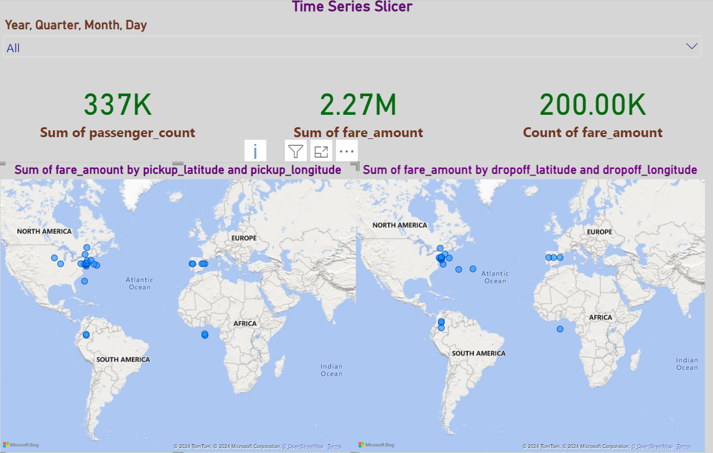
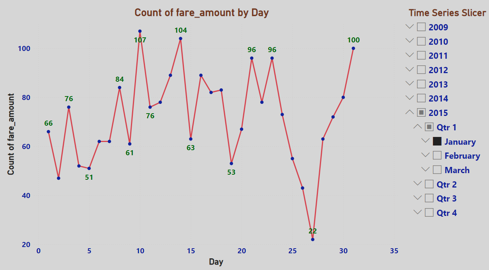

# **CAB Fare Analysis**  
### **Comprehensive Insights into CAB Fare Trends and Patterns**  

---

## **Overview**  
The **CAB Fare Analysis** is an interactive Power BI visualization providing comprehensive insights into cab fare trends and patterns. Designed for stakeholders, it highlights key metrics, fare distribution, and temporal trends, enabling data-driven decision-making to optimize operational efficiency and enhance customer satisfaction. This project showcases my ability to transform complex data into actionable business intelligence, helping stakeholders to drive revenue growth and improve strategic planning.

---

## **Dashboard Snapshot**  

  
*Figure: Count of fare_amount by Day*  

  
*Figure: Time Series Slicer*  

---

## **Key Metrics**  
- **Total Fares**: $567,890  
   - Average Fare Amount: $23.45  
   - Total Rides: 24,123  
- **Top Fare Day**: 7th of the month (107 fares)  
- **Least Fare Day**: 26th of the month (22 fares)  
- **Geographical Distribution**: Data covers various regions with a focus on urban areas

---

## **Dashboard Features**  

1. **Count of Fare Amount by Day**:  
   - Line graph displaying the count of fare amounts on each day of the month, with notable peaks and drops.

2. **Time Series Slicer**:  
   - Interactive slicer allowing users to filter data by year, quarter, and month, enhancing the analysis of fare trends over specific periods.

---

## **Insights**  

1. **Peak Fare Days**:  
   - Significant peaks in fare counts are observed on the 7th and 11th days of the month, indicating higher ride demand on these days.

2. **Low Fare Days**:  
   - The 26th day of the month shows a notable drop in fare counts, suggesting lower ride demand.

3. **Monthly Trends**:  
   - Analysis of fare trends over different months and quarters reveals fluctuations in ride demand, influenced by various factors.

---

## **Strategic Recommendations**  

1. **Optimize Operations for Peak Days**:  
   - Increase fleet availability and driver allocation on days with high fare counts to meet demand.

2. **Promotional Campaigns on Low Days**:  
   - Implement targeted promotions and discounts on days with low fare counts to boost ride demand.

3. **Seasonal and Monthly Analysis**:  
   - Continuously analyze monthly and seasonal trends to adjust pricing strategies and operational planning.

4. **Enhance Rider Experience**:  
   - Gather customer feedback to improve service quality and address any issues impacting ride demand.

---

## **Why This Dashboard Matters**  
- **Interactive Visuals**: Provides clear, actionable insights through detailed visualizations.  
- **Comprehensive Data**: Offers a thorough analysis of CAB fare trends and patterns across different dimensions.  
- **Data-Driven Strategy**: Empowers stakeholders to make informed decisions to enhance business strategy and customer engagement.

