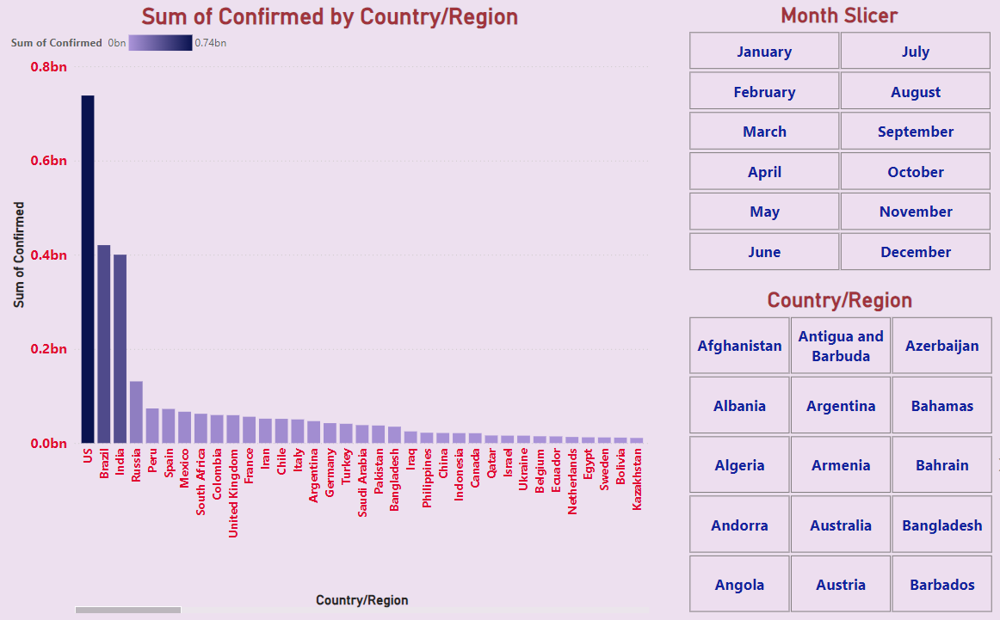
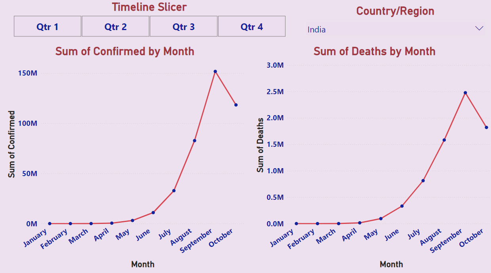
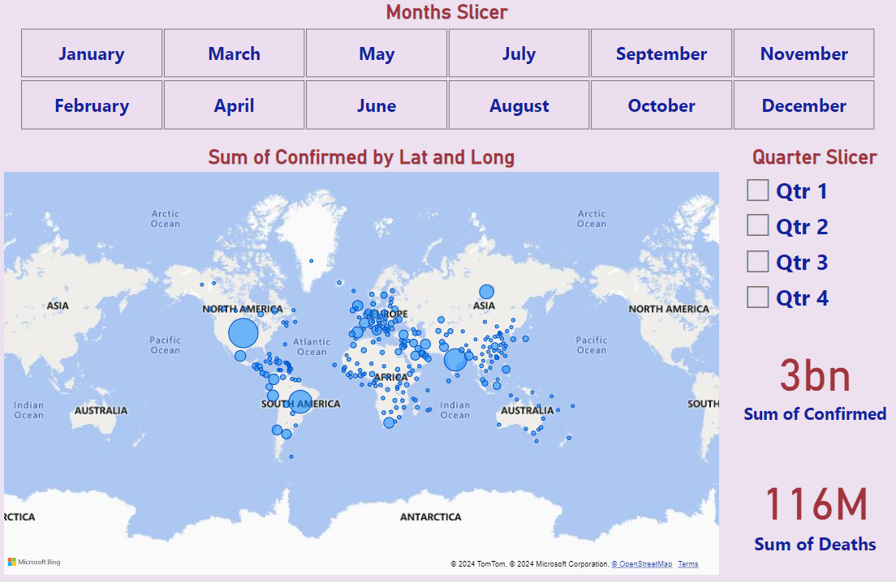
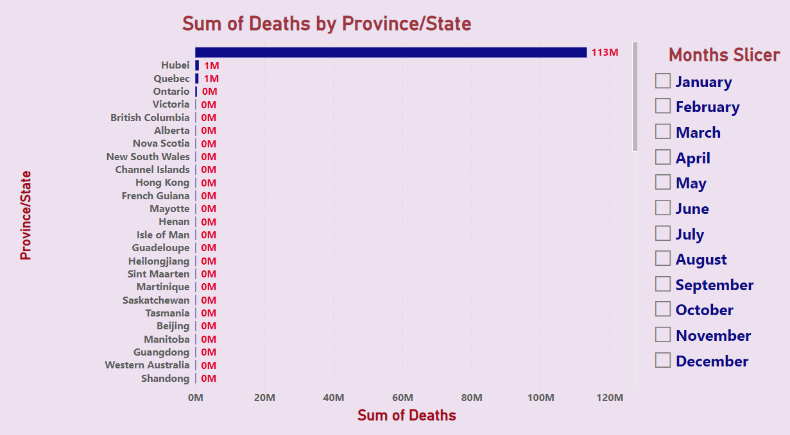

# **COVID-19 Region Wise Data Analysis**  
### **Comprehensive Insights into COVID-19 Trends and Impact by Region**  

---

## **Overview**  
The **COVID-19 Region Wise Data Analysis** is an interactive Power BI visualization providing in-depth insights into the spread and impact of COVID-19 across different regions. Designed for stakeholders, it highlights key metrics, death and case distribution, and temporal trends, enabling **data-driven decision-making** to optimize response strategies, enhance public health measures, and save lives. This project showcases my ability to transform complex pandemic data into actionable business intelligence, helping stakeholders drive informed decisions and improve strategic planning.

---

## **Dashboard Snapshot**  

  
*Figure: COVID-19 Confirmed Cases by Country/Region*  

  
*Figure: COVID-19 Monthly Trends in Confirmed Cases and Deaths in India*  

  
*Figure: Visualization of Global COVID-19 Confirmed Cases and Deaths*  

  
*Figure: Sum of Deaths by Province/State with Monthly Filtering*

---

## **Key Metrics**  
- **Total Deaths**: 114 million  
   - Highest Deaths in Hubei: 113 million  
   - Deaths in Quebec: 1 million  
- **Total Confirmed Cases**: Not specified in the provided images
- **Geographical Distribution**: Data covers multiple countries and regions, with a focus on majorly affected areas

---

## **Key Features**  

1. **Sum of Deaths by Province/State**:  
   - Bar chart displaying the total number of deaths across various provinces and states, with Hubei showing the highest mortality.

2. **Time Series Slicer**:  
   - Interactive slicer allowing users to filter data by specific months, enhancing the analysis of death trends over time.

3. **Confirmed Cases by Country/Region**:  
   - Map indicating the number of confirmed COVID-19 cases in different countries/regions, with a color gradient showing the range from low to high cases.

4. **Deaths Over Time**:  
   - Line chart showcasing the trend of deaths over time, highlighting significant spikes and trends.

---

## **Insights**  

1. **High Mortality in Hubei**:  
   - The province of Hubei shows an exceptionally high number of deaths, totaling 113 million. This indicates the significant impact of COVID-19 in this region and may reflect early outbreak data.

2. **Quebec's Mortality**:  
   - Quebec is the only other province/state with a recorded number of deaths, totaling 1 million, indicating its severe impact.

3. **Geographical Case Distribution**:  
   - The map of confirmed cases shows that some countries/regions have a high number of cases, which may correlate with the reported deaths.

4. **Temporal Trends**:  
   - The line chart of deaths over time reveals significant spikes, indicating periods of high mortality which could correlate with waves of the pandemic.

5. **Monthly Data Filtering**:  
   - The presence of a "Months Slicer" suggests the ability to analyze trends over specific periods, which can provide insights into the progression of the pandemic and the effectiveness of interventions.

---

## **Strategic Recommendations**  

1. **Focus on High Impact Regions**:  
   - Allocate resources and medical support to regions like Hubei and Quebec, which have shown high mortality rates, to mitigate further impacts.

2. **Investigate Data Accuracy**:  
   - Ensure the accuracy and reliability of the reported data, particularly in regions with exceptionally high or low numbers.

3. **Utilize Temporal Analysis**:  
   - Leverage the time series slicer to identify specific periods with high mortality rates and analyze the factors contributing to these spikes for better preparedness in future waves.

4. **Public Health Interventions**:  
   - Implement targeted public health measures in regions with high case and death rates to curb the spread and reduce mortality.

5. **Enhance Data Transparency**:  
   - Promote transparency in data reporting and sharing to ensure a comprehensive understanding of the pandemic's impact and to coordinate global response efforts.

---

## **Why This Project Matters**  
1. **Strategic Resource Allocation**:  
      - Enables targeted resource distribution by identifying high-impact regions, ensuring that medical supplies and personnel are directed where they are needed most.

2. **Enhanced Public Health Measures**:  
      - Facilitates the implementation of effective public health interventions by providing clear insights into temporal and geographical trends.

3. **Global Collaboration**:  
      - Promotes international data transparency and cooperation, essential for a coordinated global response to the pandemic.

4. **Proactive Planning**:  
      - Empowers policymakers and health officials with the data needed to anticipate future trends and prepare for subsequent waves of infections.

5. **Informed Decision-Making**:  
      - Supports data-driven decisions that can save lives, reduce infection rates, and mitigate the overall impact of the pandemic on society.

6. **Data Transparency**:  
      - Enhances the transparency of data reporting and sharing, fostering trust and coordinated efforts in managing the pandemic.

7. **Regional Impact Analysis**:  
      - Provides detailed insights into the impact of COVID-19 across different regions, aiding in localized response strategies.

8. **Continuous Monitoring**:  
      - Enables continuous monitoring of trends and interventions, ensuring that response strategies remain effective and adaptive to new developments.

---

By integrating these strategic insights, the **COVID-19 Region Wise Data Analysis** project not only enhances the effectiveness of public health responses but also fosters global cooperation and proactive planning for future health crises.
