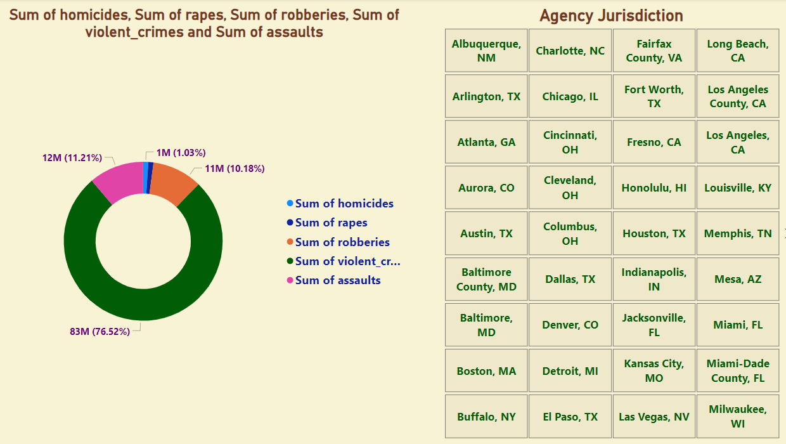
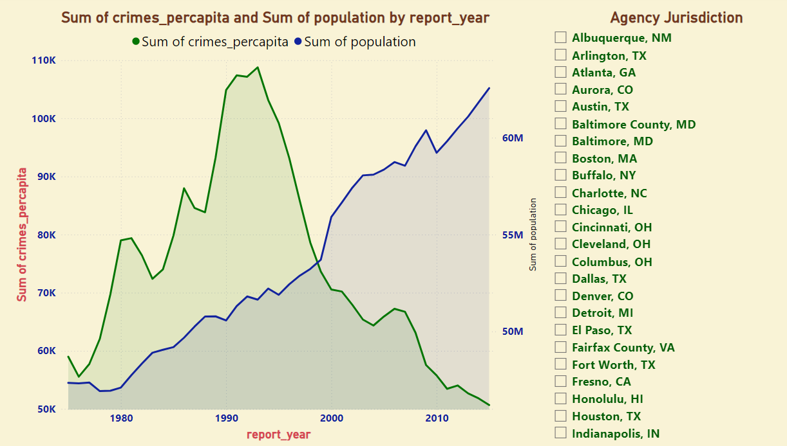
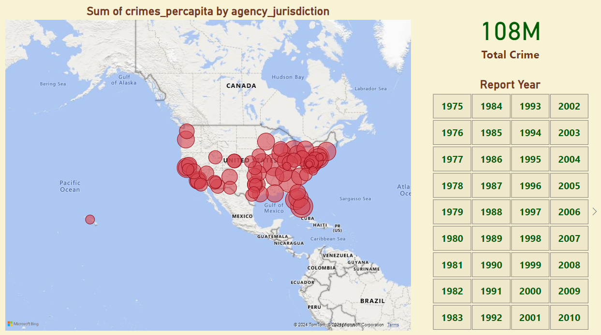
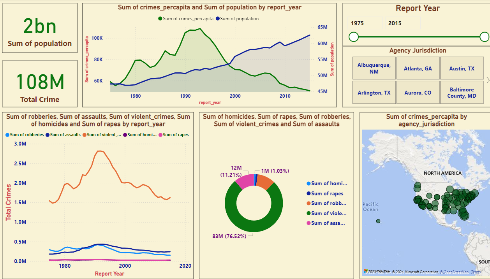

# **USA Crime Data Analysis**  
### **Comprehensive Insights into Crime Trends and Patterns Across the USA**  

---

## **Overview**  
The **USA Crime Data Analysis** is an interactive Power BI visualization providing comprehensive insights into crime trends and patterns across various regions in the USA. Designed for stakeholders, it highlights key metrics, crime distribution, and temporal trends, enabling **data-driven decision-making** to enhance public safety measures, optimize resource allocation, and develop effective crime prevention strategies. This project showcases my ability to transform complex crime data into actionable business intelligence, helping stakeholders drive informed decisions and improve public safety.

---

## **Dashboard Snapshot**  

  
*Figure: Distribution of Violent Crimes by Type and Agency Jurisdiction*  

  
*Figure: Trends in Crime Rates and Population Growth by Year*  

  
*Figure: Geospatial Distribution and Temporal Analysis of Crime Rates in the United States (1975-2010)*  

  
*Figure: USA Crime Statistics and Population Dynamics Dashboard - Unveiling Trends and Insights Over Four Decades*  

---

## **Key Metrics**  
- **Total Population**: 2 billion  
- **Total Crime Incidents**: 108 million  
- **Top Jurisdictions**: Albuquerque, NM; Atlanta, GA; Austin, TX; Arlington, TX; Aurora, CO; Baltimore County, MD  
- **Crime Types Distribution**:  
   - Homicides: 12 million (11.21%)  
   - Rapes: 1 million (1.03%)  
   - Robberies: 83 million (76.52%)  
   - Violent Crimes: (not specified)  
   - Assaults: (not specified)

---

## **Key Features**  

1. **Population and Total Crime**:  
   - Displaying the total population and total crime incidents to provide context on the scale of the analysis.

2. **Crime Trends Over Time**:  
   - Line graph showing the trends of crimes per capita and population from 1975 to 2015, allowing for an analysis of crime trends relative to population growth.

3. **Crime Distribution by Type**:  
   - Pie chart illustrating the distribution of different types of crimes, highlighting the prevalence of robberies, homicides, rapes, and other violent crimes.

4. **Geographical Distribution of Crimes**:  
   - Map showing the distribution of crimes per capita across different jurisdictions, providing a visual representation of crime hotspots.

5. **Violent Crimes and Homicides Trends**:  
   - Line graph displaying the trends of various types of violent crimes, including robberies, assaults, violent crimes, homicides, and rapes from 1975 to 2020.

---

## **Insights**  

1. **High Crime Incidents in Specific Jurisdictions**:  
   - Jurisdictions like Albuquerque, NM; Atlanta, GA; and Austin, TX show significant crime incidents, indicating the need for targeted intervention.

2. **Robberies Dominate Crime Types**:  
   - Robberies constitute the majority of the crimes, accounting for 76.52% of total incidents, suggesting a need for focused anti-robbery measures.

3. **Temporal Crime Trends**:  
   - The crime trends over time show fluctuations with certain peaks, which could be analyzed further to understand the underlying causes and patterns.

4. **Geographical Crime Hotspots**:  
   - The map reveals specific areas with high crime rates per capita, which can help in resource allocation and deployment of law enforcement agencies.

5. **Violent Crimes Analysis**:  
   - Trends in violent crimes, particularly homicides and assaults, provide insights into the areas requiring urgent attention and preventive measures.

---

## **Strategic Recommendations**  

1. **Targeted Interventions in High Crime Areas**:  
   - Focus law enforcement and community programs in high-crime jurisdictions to address specific issues and reduce crime rates.

2. **Anti-Robbery Measures**:  
   - Implement specialized anti-robbery initiatives and increase surveillance in areas with high robbery incidents to curb the crime.

3. **Data-Driven Resource Allocation**:  
   - Utilize the geographical distribution data to allocate resources and deploy law enforcement effectively in crime hotspots.

4. **Temporal Analysis for Crime Prevention**:  
   - Analyze the temporal trends to identify periods with high crime rates and develop timely interventions to prevent crime surges.

5. **Community Engagement**:  
   - Engage local communities in crime prevention programs, encouraging public participation and collaboration with law enforcement.

---

## **Why This Project Matters**  
1. **Holistic Crime Understanding**:  
      - Offers a comprehensive analysis of crime data over four decades, empowering stakeholders with a deep understanding of both historical and current crime trends.

2. **Precision in Resource Allocation**:  
      - Utilizes geospatial and temporal insights to help law enforcement agencies allocate resources more effectively, targeting high-crime areas and periods with precision.

3. **Proactive Crime Prevention**:  
      - Identifies patterns and peaks in crime rates, enabling the development of proactive measures and strategies to reduce the likelihood of future incidents.

4. **Community Safety Enhancement**:  
      - Supports the implementation of targeted community programs and initiatives, fostering safer environments and enhancing public trust in law enforcement.

5. **Policy Formulation**:  
      - Provides policymakers with evidence-based insights, guiding the creation of more effective laws and public safety policies tailored to the unique needs of different regions.

6. **Long-Term Trend Analysis**:  
      - Tracks crime trends over an extended period, providing valuable context for understanding how crime patterns evolve over time and the impact of various interventions.

7. **Data-Driven Decisions**:  
      - Empowers stakeholders to make informed, data-driven decisions that enhance public safety, allocate resources efficiently, and develop effective crime prevention strategies.

---

By leveraging these strategic insights, the **USA Crime Data Analysis** project significantly enhances public safety measures, optimizes resource allocation, and drives effective crime prevention strategies.
