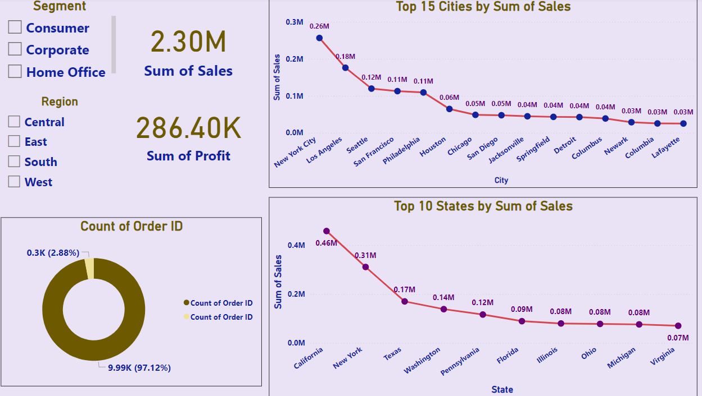
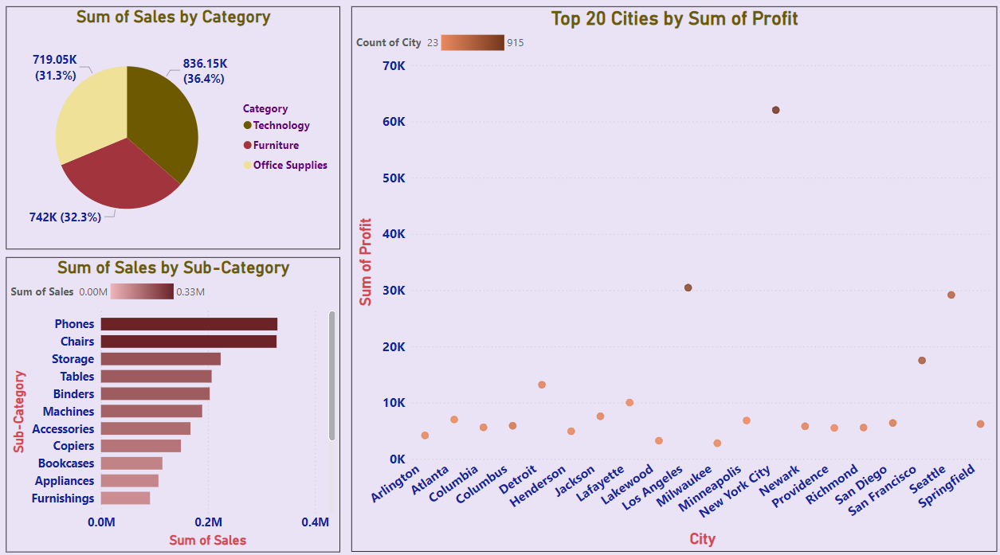
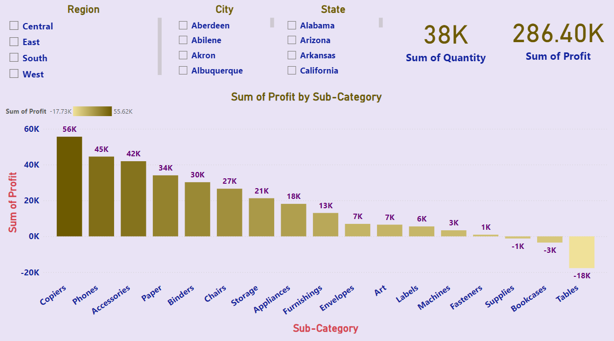

# **Superstore Sales Analysis**  
### **Comprehensive Insights into Sales Performance and Profitability Across Categories and Cities**  

---

## **Overview**  
The **Superstore Sales Analysis** is an interactive Power BI visualization designed to provide comprehensive insights into sales performance and profitability across various product categories and cities. This project showcases my ability to transform complex sales data into actionable business intelligence, helping stakeholders drive informed decisions to optimize sales strategies, enhance profitability, and improve overall business performance.

---

## **Dashboard Snapshot**  

  
*Figure: Sales and Profit Analysis by Segment, Region, City, and State*  

  
*Figure: Sales and Profit Analysis by Category, Sub-Category, and City*  

  
*Figure: Profitability Analysis by Product Sub-Category*

---

## **Key Metrics**  
- **Total Sales by Category**:  
   - Technology: 719.05K (31.3%)  
   - Furniture: 836.15K (36.4%)  
   - Office Supplies: 742K (32.3%)
- **Top Sub-Categories by Sales**:  
   - Phones: ~0.33M  
   - Chairs: ~0.30M  
   - Storage: ~0.25M  
   - Tables: ~0.20M  
   - Binders: ~0.15M  
   - Machines: ~0.12M  
   - Accessories: ~0.10M  
   - Copiers: ~0.08M  
   - Bookcases: ~0.06M  
   - Appliances: ~0.04M  
   - Furnishings: ~0.02M
- **Top Sub-Categories by Profit**:  
   - Copiers: 56K  
   - Phones: 45K  
   - Accessories: 42K  
   - Paper: 34K  
   - Binders: 30K  
   - Chairs: 27K  
   - Storage: 21K  
   - Appliances: 18K  
   - Furnishings: 13K  
   - Envelopes: 7K  
   - Art: 7K  
   - Labels: 6K  
   - Machines: 3K  
   - Fasteners: 1K  
   - Supplies: -1K  
   - Bookcases: -3K  
   - Tables: -18K

---

## **Key Features**  

1. **Sum of Sales by Category**:  
   - A pie chart visualizing the distribution of sales across Technology, Furniture, and Office Supplies, providing a clear overview of sales contributions by category.

2. **Sum of Sales by Sub-Category**:  
   - A horizontal bar chart displaying the sum of sales for various sub-categories, highlighting the top-performing products in terms of sales.

3. **Sum of Profit by Sub-Category**:  
   - A bar chart showing the sum of profit for different product sub-categories, ranging from highest to lowest, providing insights into the profitability of each sub-category.

---

## **Insights**  

1. **Sales Distribution Across Categories**:  
   - The sales distribution reveals that Furniture accounts for the highest sales (36.4%), followed by Office Supplies (32.3%) and Technology (31.3%).

2. **Top-Performing Sub-Categories**:  
   - Phones and Chairs are the top-performing sub-categories in terms of sales, indicating high demand and significant contributions to total sales.

3. **Profitability of Sub-Categories**:  
   - Copiers and Phones are the most profitable sub-categories, highlighting their importance in driving overall profitability.

---

## **Strategic Recommendations**  

1. **Focus on High-Demand Products**:  
   - Increase inventory and marketing efforts for top-performing sub-categories like Phones and Chairs to capitalize on their high demand and boost sales.

2. **Enhance Profitability of Other Sub-Categories**:  
   - Analyze and improve the profitability of sub-categories with lower profits, such as Bookcases and Tables, by optimizing pricing strategies and reducing costs.

3. **Target High-Profit Cities**:  
   - Implement targeted marketing campaigns and promotional offers in cities with high profitability to further strengthen market presence and drive sales growth.

4. **Optimize Product Mix**:  
   - Utilize insights from the dashboard to optimize the product mix, ensuring a balanced inventory that meets customer demand while maximizing profitability.

5. **Leverage Data for Decision-Making**:  
   - Use the insights from the dashboard to make data-driven decisions on inventory management, pricing strategies, and marketing initiatives.

---

## **Why This Project Matters**  
1. **Informed Decision-Making**:  
      - Empowers stakeholders with data-driven insights to make strategic decisions that optimize sales and profitability.

2. **Operational Efficiency**:  
      - Highlights key areas for improvement, enabling businesses to streamline operations and reduce inefficiencies.

3. **Market Responsiveness**:  
      - Provides real-time insights into sales trends and customer preferences, allowing for quick adaptation to market changes.

4. **Profit Maximization**:  
      - Identifies high-performing and high-profit products, guiding inventory and marketing strategies to maximize profits.

5. **Customer-Centric Approach**:  
      - Helps businesses understand customer behavior and preferences, fostering a customer-centric approach that enhances satisfaction and loyalty.

6. **Strategic Inventory Management**:  
      - Leverages insights to optimize inventory levels, ensuring availability of high-demand products while minimizing excess stock.

---

By integrating these strategic insights, the **Superstore Sales Analysis** project drives profitability, enhances customer satisfaction, and ensures efficient operations, positioning the business for sustained growth and success.
