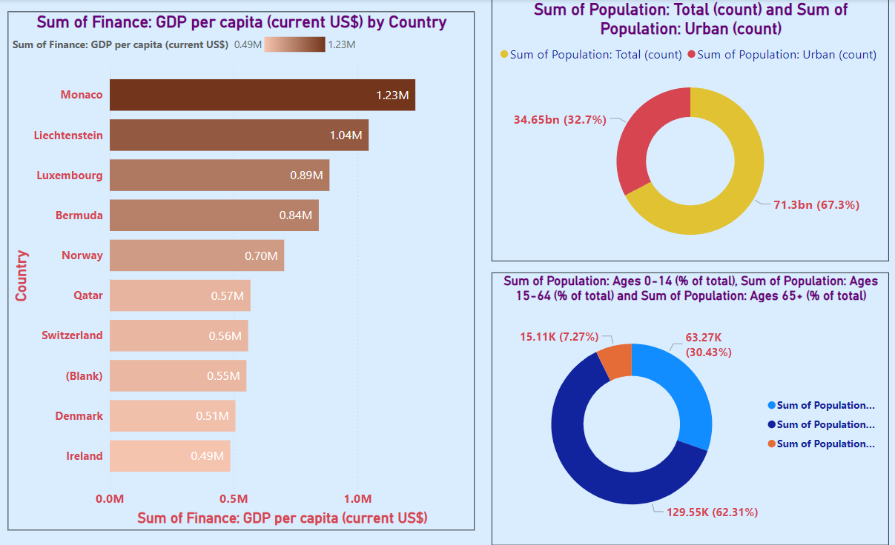
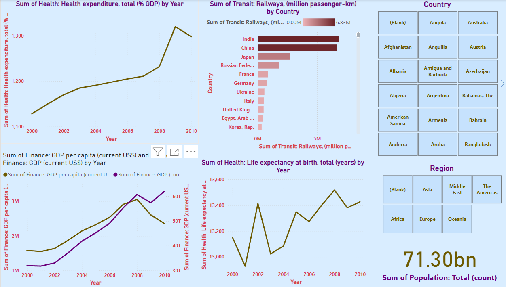
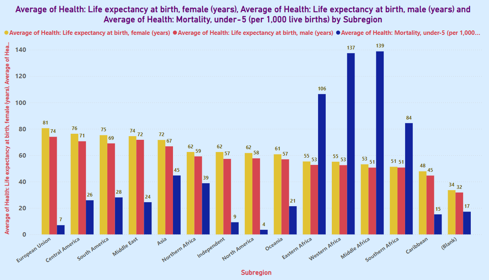
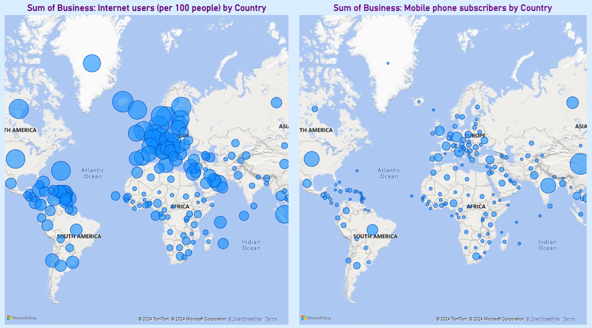

# **Country Wise GDP & Population Analysis**  
### **Comprehensive Insights into Global Economic, Demographic, and Digital Trends**  

---

## **Overview**  
The **Country Wise GDP & Population Analysis** is an interactive Power BI visualization designed to provide comprehensive insights into global economic, demographic, and digital trends. This project showcases my ability to transform complex economic, demographic, and digital data into actionable business intelligence, helping stakeholders drive informed decisions for policy-making, resource allocation, and strategic planning.

---

## **Dashboard Snapshot**  

  
*Figure: Comprehensive Economic and Population Analysis with Demographic Breakdown*  

  
*Figure: Global Socio-Economic and Health Trends Analysis Dashboard*  

  
*Figure: Health Metrics by Subregion: Life Expectancy and Under-5 Mortality Rate*

  
*Figure: Digital Connectivity Analysis: Internet Users and Mobile Phone Subscribers by Country*

---

## **Key Metrics**  
- **Total GDP by Country**:  
   - Detailed visualization of GDP distribution across different countries, highlighting economic powerhouses and developing economies.
- **Population Distribution**:  
   - Comprehensive analysis of population distribution by country, providing insights into demographic trends and growth patterns.
- **Global Health Indicators**:  
   - Life expectancy at birth (female and male) and under-5 mortality rate by subregion, illustrating disparities in health outcomes.
- **Digital Connectivity**:  
   - Internet users (per 100 people) and mobile phone subscribers by country, highlighting global digital access and connectivity.

---

## **Key Features**  

1. **World GDP and Population**:  
   - A comprehensive view of the global economic landscape, showcasing GDP and population distribution by country. This visualization helps identify major economic players and demographic trends.

2. **Global Health Indicators**:  
   - A detailed comparison of key health metrics, such as life expectancy at birth and under-5 mortality rates, across different subregions. This analysis highlights significant disparities in health outcomes and can inform targeted interventions.

3. **Life Expectancy and Mortality Rate by Subregion**:  
   - A bar chart that compares life expectancy for females and males, and under-5 mortality rates across various subregions. This visualization provides a clear picture of regional health disparities and their implications for policy and resource allocation.

4. **Digital Connectivity: Internet Users and Mobile Subscribers**:  
   - Two side-by-side world maps displaying the distribution of internet users (per 100 people) and mobile phone subscribers by country. Larger circles represent higher penetration rates, highlighting the digital divide and varying levels of connectivity across regions.

---

## **Insights**  

1. **Economic Powerhouses**:  
   - The GDP distribution highlights countries with the largest economies, such as the United States, China, and Japan, and their significant contributions to the global economy.

2. **Population Trends**:  
   - The population distribution analysis reveals countries with the highest populations, such as China and India, and their implications for economic growth and resource needs.

3. **Health Disparities**:  
   - The life expectancy and under-5 mortality rate comparison underscores significant health disparities across subregions. For instance, the European Union has high life expectancy and low under-5 mortality rates, while regions like Western Africa face lower life expectancy and higher under-5 mortality rates.

4. **Digital Divide**:  
   - The digital connectivity analysis highlights the varying levels of internet and mobile phone penetration across different regions. North America, Europe, and parts of Asia exhibit higher penetration rates, while Africa and some parts of South America show lower connectivity levels.

---

## **Strategic Recommendations**  

1. **Focus on Health Interventions**:  
   - Prioritize health interventions in subregions with low life expectancy and high under-5 mortality rates to improve overall health outcomes.

2. **Economic Development Initiatives**:  
   - Implement economic development initiatives in countries with lower GDP to stimulate growth and reduce global economic disparities.

3. **Enhance Digital Connectivity**:  
   - Invest in infrastructure and policies to improve internet and mobile phone penetration in regions with low connectivity, addressing the digital divide and promoting inclusive growth.

4. **Resource Allocation**:  
   - Optimize resource allocation based on population trends and health indicators to address the specific needs of each region effectively.

5. **Data-Driven Policy-Making**:  
   - Utilize the insights from the dashboard to inform data-driven policy-making and strategic planning for sustainable development.

---

## **Why This Project Matters**  
1. **Holistic View of Global Trends**:  
      - Integrates economic, demographic, and digital data to provide a comprehensive understanding of global trends and their interconnections.

2. **Informed Policy-Making**:  
      - Offers evidence-based insights that support the formulation of effective policies aimed at fostering economic growth, improving health outcomes, and bridging the digital divide.

3. **Targeted Resource Allocation**:  
      - Highlights regions that require focused interventions, enabling more efficient allocation of resources to areas with the greatest need.

4. **Promotes Digital Inclusion**:  
      - Identifies disparities in digital connectivity, guiding investments and policies that promote equitable access to digital technologies and services.

5. **Empowers Stakeholders**:  
      - Equips policymakers, business leaders, and researchers with the tools needed to make informed decisions that drive sustainable development and global progress.

6. **Addresses Health Disparities**:  
      - Provides insights into significant health disparities across regions, enabling targeted health interventions to improve overall global health outcomes.

7. **Supports Sustainable Development**:  
      - By analyzing population growth and economic trends, the project informs sustainable development strategies that balance economic growth with environmental and social considerations.

8. **Enhances Global Collaboration**:  
      - Fosters international cooperation by providing a comprehensive data platform that stakeholders across the globe can use for comparative analysis and collaborative decision-making.

---

By integrating these strategic insights, the **Country Wise GDP & Population Analysis** project supports informed decision-making, drives sustainable development, and promotes equitable growth across global communities.
