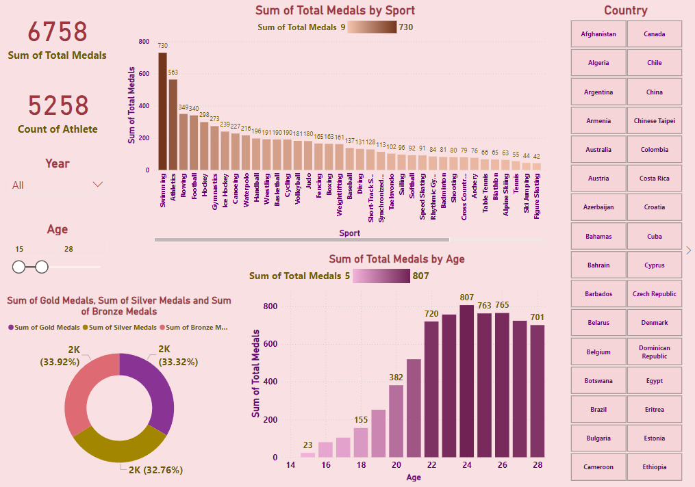

# **Analysis of Olympics Dashboard**  
### **Comprehensive Insights into Olympic Games Participation and Performance**  

---

## **Overview**  
The **Analysis of Olympics Dashboard** is an interactive Power BI visualization designed to provide a deep dive into the participation and performance of athletes in the Olympic Games. This project highlights my proficiency in converting intricate sports data into meaningful insights, enabling stakeholders to grasp trends, pinpoint key performance metrics, and make well-informed decisions for future events.

---

## **Dashboard Snapshot**  

  
*Figure: Count of Athlete by Year*  

---

## **Key Metrics**  
- **Total Medals and Athlete Count**:  
   - Displaying the total number of medals (6758) and the total count of athletes (5258).

- **Medals by Sport**:  
   - Bar chart showing the sum of total medals by sport, with Swimming leading with 730 medals, followed by Athletics with 563 medals.

- **Medals by Age**:  
   - Bar chart displaying the sum of total medals by age. The age group 22 has the highest medal count with 807 medals, followed by age 24 with 763 medals.

- **Medal Distribution**:  
   - Donut chart showing the distribution of gold, silver, and bronze medals. Each type of medal has approximately one-third of the total medals, with gold medals at 33.92%, silver medals at 33.32%, and bronze medals at 32.76%.

---

## **Key Features**  

1. **Total Medals and Athlete Count**:  
   - The top left corner displays the total number of medals (6758) and the total count of athletes (5258), providing a quick overview of the overall achievements.

2. **Medals by Sport**:  
   - A bar chart showing the sum of total medals by sport, highlighting the most successful sports in the Olympic Games. Swimming and Athletics are the top two sports, indicating high competition and participation levels.

3. **Medals by Age**:  
   - A bar chart displaying the sum of total medals by age, providing insights into the age groups that have achieved the most success in the Olympic Games. The age groups 22 and 24 stand out with the highest medal counts.

4. **Medal Distribution**:  
   - A donut chart showing the distribution of gold, silver, and bronze medals, offering a visual representation of the overall medal distribution among the top performers.

5. **Country List and Age Filter**:  
   - A list of countries provided on the right side allows for filtering or selecting data based on the country. An age filter slider ranges from 15 to 28 years, enabling users to analyze medal counts by specific age groups.

---

## **Insights**  

1. **Sport Dominance**:  
   - Swimming and Athletics are the most dominant sports in terms of total medals won, indicating a high level of competition and participation in these sports.

2. **Age Performance**:  
   - Athletes aged 22 and 24 are the most successful in terms of medal counts, suggesting these ages might be the peak performance years for athletes.

3. **Balanced Medal Distribution**:  
   - The distribution of gold, silver, and bronze medals is relatively balanced, indicating a fair level of competition across different events.

4. **Overall Performance**:  
   - The total medals (6758) and athlete count (5258) provide an overview of the scale of participation and success in the Olympic Games.
  
5. **Athlete Participation**:
   - The data reveals significant fluctuations in athlete participation over the years. There is a noticeable peak in 2000 with 1838 athletes, followed by a sharp decline in 2002 to 407 athletes. Participation gradually increases in the following years, with another peak in 2012 at 1771 athletes. Understanding the factors contributing to these variations can provide valuable insights for planning and enhancing future participation.

---

## **Strategic Recommendations**  

1. **Focus on Peak Ages**:  
   - Training programs and resources could be optimized for athletes in their early twenties, as this age group shows the highest medal counts.

2. **Investment in Dominant Sports**:  
   - Additional investment and support could be directed towards Swimming and Athletics to maintain and enhance performance in these high-medal sports.

3. **Country-Specific Analysis**:  
   - Further analysis could be conducted on a country-by-country basis to identify strengths and weaknesses in specific sports and age groups.

4. **Enhance Athlete Support**:  
   - Provide enhanced support for athletes, including mental health resources, career development programs, and recognition of their achievements. This can help create a positive environment that encourages more athletes to participate and perform at their best.

5. **Promote Consistent Participation**:  
   - Implement strategies to maintain and promote consistent athlete participation in future Olympic Games. This could include initiatives to encourage greater involvement from smaller nations, grassroots development programs, and international collaborations.

---

## **Why This Project Matters**  
1. **Holistic Athlete Analysis**:  
      - Provides a comprehensive view of athlete participation and performance, offering insights into trends and patterns that are critical for optimizing training and development programs.

2. **Strategic Investment**:  
      - Identifies key areas for investment, such as specific sports and age groups, to maximize the potential for winning medals and enhancing overall performance.

3. **Global Competitiveness**:  
      - Enhances the ability to analyze and compare performance across countries, helping to identify strengths and weaknesses and foster international competitiveness.

4. **Data-Driven Decision Making**:  
      - Supports data-driven decisions that can improve planning, resource allocation, and policy-making for future Olympic Games, ensuring the best outcomes for athletes and nations.

5. **Promotes Inclusive Participation**:  
      - Highlights trends in athlete participation, encouraging initiatives that promote inclusivity and broader participation across different countries and demographics.

6. **Performance Peak Identification**:  
      - Identifies peak performance ages and sports, allowing for focused training and support to maximize athlete potential and medal outcomes.

7. **Historical Performance Insight**:  
      - Provides historical insights into participation and performance trends over the years, guiding future strategies for athletic development and competition.

---

By integrating these strategic insights, the **Analysis of Olympics Dashboard** project enhances athlete performance, drives strategic investments, and fosters a competitive and inclusive environment in the Olympic Games.
