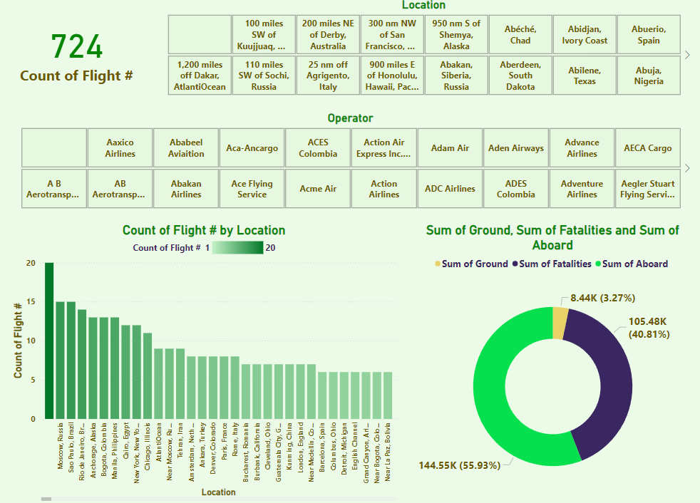

# **Plane Crash Data Analysis**  
### **Comprehensive Insights into Aviation Safety and Incident Trends**  

---

## **Overview**  
The **Plane Crash Data Analysis** is an interactive Power BI visualization designed to provide comprehensive insights into aviation safety, incident trends, and the factors contributing to plane crashes. This project highlights my capability to transform complex aviation data into meaningful insights, enabling stakeholders to understand trends, identify key risk factors, and implement safety improvements to reduce future incidents.

---

## **Dashboard Snapshot**  

  
*Figure: Dashboard_Image* 

---

## **Key Metrics**

- **Total Fatalities**:
  - Displaying the total number of fatalities across various types of aircraft, years, phases of flight, and countries.

- **Fatalities by Aircraft Type**:
  - Treemap showing the sum of fatalities by different aircraft types, highlighting the most hazardous models.

- **Fatalities by Year**:
  - Line chart illustrating the total fatalities over different years, indicating trends and significant events.

- **Fatalities by Phase of Flight**:
  - Bar chart detailing the sum of fatalities during various phases of flight, such as takeoff, cruise, and landing.

- **Fatalities by Country**:
  - Map visualization showing the number of plane crash fatalities by country, providing a geographic perspective on incidents.

- **Incidents by Month**:
  - Line chart showing the number of incidents over time by month, identifying seasonal patterns and trends.

---

## **Key Features**

1. **Sum of Fatalities by Type**:
  - A treemap visualization categorizing various aircraft types by the total number of fatalities. The Douglas DC-3 has the highest number of fatalities at 4.79K, followed by Antonov AN-26 with 1.08K, and Douglas DC-6B with 1.06K.

2. **Total Fatalities by Year**:
  - A line chart displaying the total number of fatalities over different years, highlighting peaks and trends. Notable years with high fatalities can be investigated further to understand the underlying causes.

3. **Sum of Fatalities by Phase of Flight**:
  - A bar chart detailing the number of fatalities during different phases of flight, such as takeoff, cruise, and landing. This helps identify the most dangerous phases of flight.

4. **Plane Crash Fatalities by Country**:
  - A map visualization showing the number of plane crash fatalities by country. Countries with higher fatalities can be targeted for safety improvements and stricter regulations.

5. **Incidents Over Time by Month**:
  - A line chart depicting the number of incidents over time by month. This helps identify seasonal patterns and trends, which can inform preventive measures during high-risk periods.

---

## **Insights**  

1. **Aircraft Type Analysis**:  
   - The treemap reveals that the Douglas DC-3 has the highest number of fatalities, significantly more than any other aircraft type. This suggests a need for further investigation into the causes of incidents involving this model.

2. **Yearly Trends**:  
   - The line chart shows fluctuations in fatalities over different years, with certain years experiencing higher fatalities. Understanding these trends can help identify historical events or changes in aviation standards that impacted safety.

3. **Phase of Flight Risks**:  
   - The bar chart indicates that certain phases of flight, such as takeoff and landing, have higher fatality rates. This highlights the need for focused safety measures during these critical phases.

4. **Geographic Distribution**:  
   - The map visualization identifies countries with higher plane crash fatalities, suggesting areas where aviation safety regulations and infrastructure need improvement.

5. **Seasonal Patterns**:  
   - The line chart of incidents over time by month shows specific months with higher incident rates. This seasonal pattern can inform the implementation of additional safety measures during high-risk periods.

---

## **Strategic Recommendations**  

1. **Targeted Safety Improvements for High-Risk Aircraft**:  
   - Investigate the causes of incidents involving aircraft types with the highest fatalities, such as the Douglas DC-3, and implement targeted safety improvements.

2. **Enhanced Safety Measures for Critical Flight Phases**:  
   - Focus on improving safety during critical phases of flight, such as takeoff and landing, by enhancing pilot training, implementing advanced technologies, and conducting thorough maintenance checks.

3. **Strengthen Aviation Safety Regulations in High-Risk Countries**:  
   - Collaborate with countries with higher plane crash fatalities to strengthen aviation safety regulations, improve infrastructure, and provide necessary resources for safety enhancements.

4. **Seasonal Safety Initiatives**:  
   - Implement additional safety measures and initiatives during months with higher incident rates, such as increased inspections, awareness campaigns, and stricter operational protocols.

5. **Continuous Monitoring and Data Analysis**:  
   - Continuously monitor and analyze aviation data to identify emerging trends, potential risks, and areas for improvement. Utilize data-driven insights to inform policy-making and safety strategies.

6. **Global Collaboration for Aviation Safety**:  
   - Foster international collaboration among aviation authorities, airlines, and safety organizations to share best practices, safety innovations, and resources to enhance global aviation safety.

---

## **Why This Project Matters**  
1. **Enhanced Safety Protocols**:  
     - Provides critical insights that support the development of more effective safety protocols and preventive measures, ultimately reducing the risk of plane crashes.

2. **Data-Driven Interventions**:  
     - Empowers aviation authorities and airlines to implement targeted interventions based on robust data analysis, ensuring resources are allocated where they are needed most.

3. **Aircraft-Specific Safety Measures**:  
     - Identifies high-risk aircraft models, such as the Douglas DC-3, enabling targeted safety improvements and maintenance practices specific to these models.

4. **Critical Flight Phase Focus**:  
     - Highlights the most dangerous phases of flight, such as takeoff and landing, allowing for enhanced safety measures and training during these critical times.

5. **Geographic Risk Identification**:  
     - Maps plane crash fatalities by country, guiding efforts to strengthen aviation regulations and infrastructure in high-risk regions.

6. **Seasonal Safety Insights**:  
     - Reveals seasonal patterns in aviation incidents, informing the implementation of additional safety measures during high-risk periods.

---

By integrating these strategic insights, the **Plane Crash Data Analysis** project significantly enhances aviation safety protocols, informs targeted interventions, and fosters global collaboration to reduce aviation-related fatalities and improve overall flight safety.
