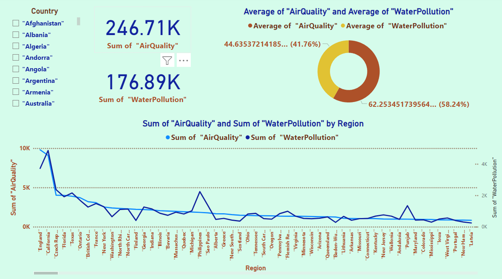
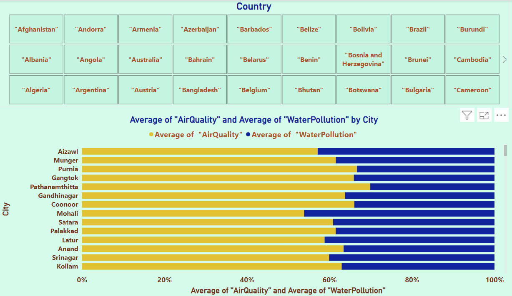

# **Air and Water Quality Analysis**  
### **Comprehensive Insights into Environmental Quality Across Cities and Countries**  

---

## **Overview**  
The **Air and Water Quality Analysis** is an interactive Power BI visualization providing comprehensive insights into air quality and water pollution across various cities and countries. This project highlights my ability to transform complex environmental data into actionable insights, enabling stakeholders to identify key trends, understand regional disparities, and implement targeted environmental policies and measures.

---

## **Dashboard Snapshot**  

  
*Figure: Global Air Quality and Water Pollution Overview*  

  
*Figure: Comparative Analysis of Average Air Quality and Water Pollution by City*

---

## **Key Metrics**

- **Air Quality and Water Pollution by City**:
  - Horizontal bar chart comparing the average air quality (in yellow) and water pollution (in blue) for different cities. The cities listed include Aizawl, Munger, Purnia, Gangtok, Pathanamthitta, Gandhinagar, Coonoor, Mohali, Satara, Palakkad, Latur, Anand, Srinagar, and Kollam.

- **Countries Covered**:
  - A comprehensive list of countries including Afghanistan, Andorra, Armenia, and more, providing a global perspective on air and water quality.

- **Top Cities by Air Quality**:
  - Aizawl, Munger, and Purnia show the highest air quality levels among the listed cities.

- **Top Cities by Water Pollution**:
  - Pathanamthitta, Gandhinagar, and Coonoor exhibit the highest water pollution levels among the listed cities.

---

## **Key Features**

1. **Comparative Analysis of Air and Water Quality**:
   - The dashboard provides a comparative analysis of air quality and water pollution levels across multiple cities, offering insights into regional environmental health.

2. **Global Coverage**:
   - The inclusion of data from a wide range of countries ensures a comprehensive understanding of global environmental trends and disparities.

3. **Visualization of Key Indicators**:
   - The use of horizontal bar charts and lists enables clear visualization of key environmental indicators, facilitating easy interpretation and analysis.

4. **City-Specific Insights**:
   - Detailed insights into the air and water quality metrics for each city, highlighting areas with significant environmental challenges.

5. **Country-Wise Distribution**:
   - Analysis of air and water quality metrics by country, providing a broader perspective on global environmental health.

---

## **Insights**  

1. **City-Specific Environmental Quality**:  
   - Cities like Aizawl and Munger have relatively better air quality but suffer from higher water pollution levels. Conversely, cities like Srinagar and Anand show more balanced levels of both air quality and water pollution.

2. **Regional Disparities**:  
   - The comparative analysis highlights significant regional disparities in environmental quality, indicating the need for city-specific policies and interventions.

3. **Global Perspective**:  
   - The list of countries included in the analysis underscores the global scope of the project, providing valuable insights into air and water quality on an international scale.

4. **Top and Bottom Performers**:  
   - Aizawl, Munger, and Purnia are top performers in air quality, while Pathanamthitta, Gandhinagar, and Coonoor are the worst in water pollution, indicating areas that need immediate attention.

5. **Balanced Cities**:  
   - Cities like Srinagar and Anand show balanced air and water quality metrics, suggesting effective environmental policies and practices in place.

---

## **Strategic Recommendations**  

1. **Targeted Environmental Policies for Cities with Imbalanced Metrics**:  
   - Implement targeted policies in cities like Aizawl and Munger to address high water pollution levels while maintaining good air quality.

2. **Regional Collaboration**:  
   - Foster regional collaboration among cities with similar environmental challenges to share best practices and resources for improving air and water quality.

3. **Global Benchmarking**:  
   - Utilize the comprehensive country data to establish global benchmarks for air and water quality, encouraging countries to strive for higher environmental standards.

4. **Public Awareness Campaigns**:  
   - Conduct public awareness campaigns in cities with poor environmental metrics to educate residents about the importance of environmental health and promote community involvement in pollution reduction efforts.

5. **Continuous Monitoring and Reporting**:  
   - Establish continuous monitoring systems to track air and water quality metrics, enabling timely interventions and policy adjustments.

6. **Focus on Worst Performers**:  
   - Prioritize interventions in cities like Pathanamthitta, Gandhinagar, and Coonoor to reduce water pollution levels and improve overall environmental health.

---

## **Why This Project Matters**  
1. **Enhanced Environmental Policies**:  
     - Provides critical insights into specific cities with high pollution levels, such as Pathanamthitta and Gandhinagar, supporting the development of targeted environmental policies and measures.

2. **Regional Disparities Awareness**:  
     - Highlights significant regional disparities in air and water quality, enabling policymakers to address city-specific environmental challenges effectively.

3. **Global Environmental Benchmarks**:  
     - Utilizes comprehensive data to establish global benchmarks for air and water quality, encouraging countries to adopt higher environmental standards.

4. **Public Health Advocacy**:  
     - Informs public health strategies by highlighting cities with extreme air and water pollution levels, promoting initiatives to reduce pollution and protect health.

5. **Promotes Regional Collaboration**:  
     - Encourages collaboration among cities with similar environmental challenges to share best practices and resources for improving air and water quality.

6. **Continuous Environmental Monitoring**:  
     - Supports the establishment of continuous monitoring systems for air and water quality, ensuring timely interventions and policy adjustments.

7. **Focus on Worst Performers**:  
     - Identifies cities like Pathanamthitta, Gandhinagar, and Coonoor with high water pollution levels, prioritizing them for immediate environmental interventions.

---

By integrating these strategic insights, the **Air and Water Quality Analysis** project drives informed decision-making, promotes effective environmental policies, and enhances public health through improved air and water quality.

