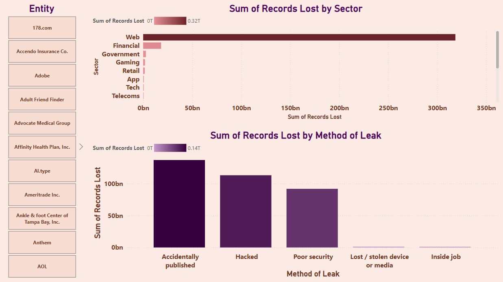
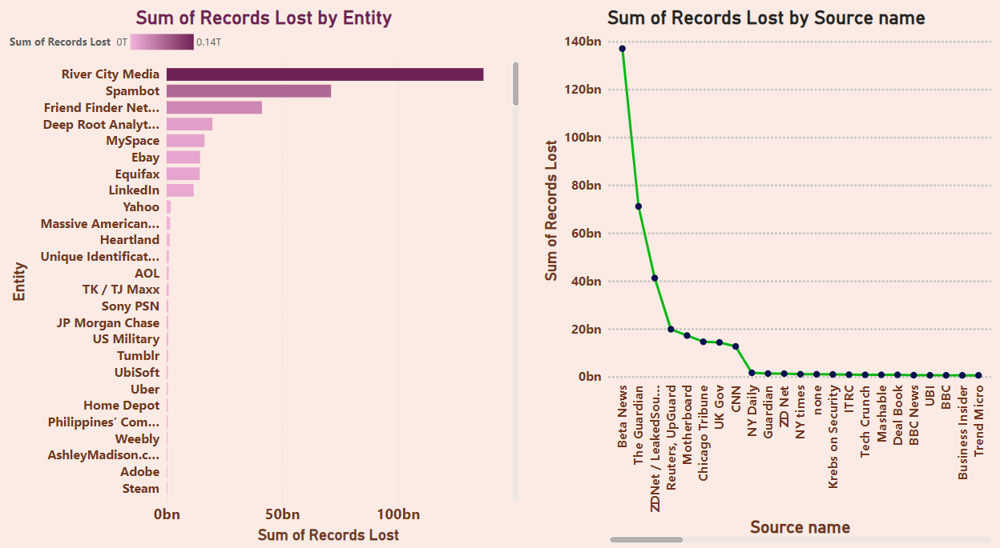

# **Lost Records Analysis**  
### **Comprehensive Insights into Data Breaches and Records Lost**  

---

## **Overview**  
The **Lost Records Analysis** is an interactive Power BI visualization providing comprehensive insights into data breaches and the number of records lost across various entities and sources. This project highlights my ability to transform complex data breach information into actionable insights, enabling stakeholders to understand trends, identify key risk factors, and implement security improvements to prevent future incidents.

---

## **Dashboard Snapshot**  

  
*Figure: Data Breach Records Lost by Sector and Method of Leak*  

  
*Figure: Comprehensive Analysis of Major Data Breaches and Records Lost by Source*  

---

## **Key Metrics**

- **Total Records Lost**:
  - Displaying the total number of records lost across various entities and sources.

- **Records Lost by Entity**:
  - Horizontal bar chart showing the sum of records lost by different entities, highlighting the most significant data breaches.

- **Records Lost by Source Name**:
  - Line graph illustrating the sum of records lost by various sources, indicating the scale of data breaches reported by different sources.

- **Records Lost Over Time**:
  - Line chart depicting the trend of lost records over time, showing significant spikes and periods of high data breach activity.

- **Records Lost by Source Type**:
  - Pie chart showing the count of records lost by source type, with the first source accounting for 84.92%, the second source for 13.44%, and the third source for 1.64%.

---

## **Key Features**

1. **Sum of Records Lost by Entity**:
  - A horizontal bar chart visualizing the sum of records lost by various entities, with River City Media having the highest record loss of approximately 140 billion records.

2. **Sum of Records Lost by Source Name**:
  - A line graph showing the sum of records lost by different sources, with Beta News reporting the highest record loss of approximately 140 billion records.

3. **Distribution of Lost Records Over Time**:
  - A line chart displaying the trend of lost records over time, highlighting significant spikes and periods of high data breach activity.

4. **Count of Records Lost by Source Type**:
  - A pie chart illustrating the distribution of records lost by source type, with the first source being the most dominant.

---

## **Insights**  

1. **High Impact Entities**:  
   - Entities like River City Media, Spambot, and Friend Finder Network have experienced the highest record losses, indicating significant data breaches within these organizations.

2. **Major Reporting Sources**:  
   - Sources like Beta News, ZDNet / LeakedSource, and The Guardian have reported the highest record losses, showcasing their role in uncovering major data breaches.

3. **Temporal Trends**:  
   - The line chart of records lost over time reveals significant spikes during certain periods, suggesting the occurrence of major data breaches and the need for heightened security during these times.

4. **Source Type Dominance**:  
   - The pie chart shows that the first source type accounts for the majority of records lost (84.92%), indicating a significant concentration of data breaches from this source.

---

## **Strategic Recommendations**  

1. **Enhanced Security Measures for High-Risk Entities**:  
   - Implement robust security measures for entities with high record losses, such as River City Media and Spambot, to prevent future data breaches.

2. **Collaboration with Reporting Sources**:  
   - Foster collaboration with key reporting sources like Beta News and ZDNet / LeakedSource to stay informed about potential data breaches and emerging threats.

3. **Continuous Monitoring and Analysis**:  
   - Establish continuous monitoring systems to track data breach activities and analyze trends, enabling timely interventions and preventive measures.

4. **Incident Response Planning**:  
   - Develop and regularly update incident response plans to ensure quick and effective action in the event of a data breach.

5. **Employee Training and Awareness**:  
   - Conduct regular training sessions and awareness programs for employees to educate them about data security best practices and the importance of safeguarding sensitive information.

6. **Invest in Advanced Security Technologies**:  
   - Invest in advanced security technologies, such as encryption and intrusion detection systems, to protect against data breaches and minimize the risk of record loss.

---

## **Why This Project Matters**  
- **Enhanced Data Security**:
    - Provides critical insights that support the development of more effective data security measures, ultimately reducing the risk of data breaches and record loss.
- **Data-Driven Decision Making**:
    - Empowers organizations with robust data analysis to implement targeted security interventions where they are needed most.
- **Historical Context**:
    - Offers a detailed historical perspective on data breaches, helping to identify long-term trends and shifts in security practices.
- **Global Impact**:
    - Facilitates international cooperation and knowledge sharing, promoting global data security standards and practices.
- **Operational Efficiency**:
    - Informs continuous improvements in data security procedures, employee training, and technology investments, enhancing overall cybersecurity.
